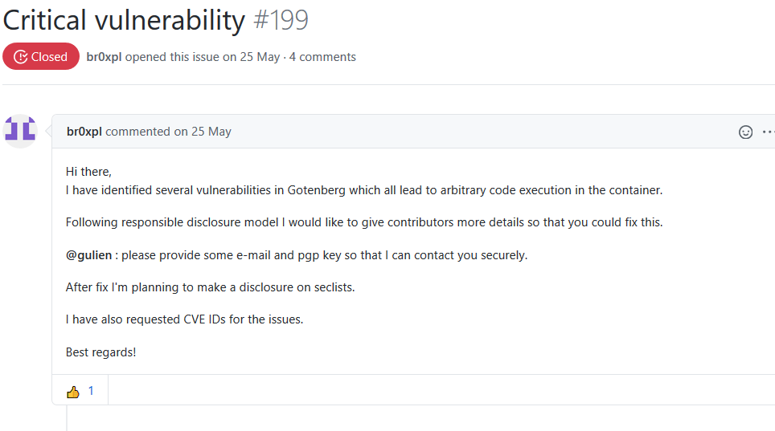
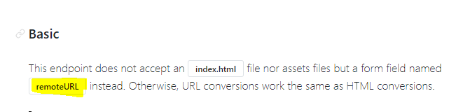
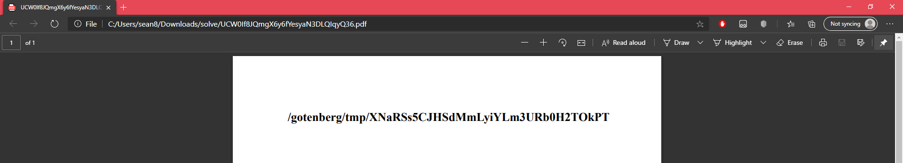
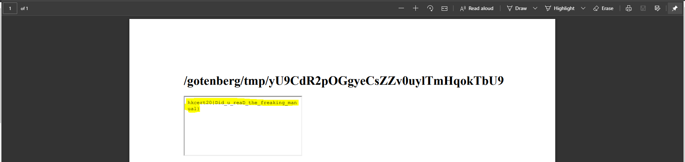

# Web Exploitation 網站保安 / Conversion Center 

## Challenges - 468 Pts(Init: 500 Pts) - 5 Solved

__Solved by S0083 - [RedTeaDev](https://github.com/RedTeaDev) __
```


Author 作者：VXRL

Description 描述:

The author is lazy. He just randomly copied a webservice called gotenberg and put a flag inside the container. Can you find the flag?

作者懶。他隨便複製了一個名為 gotenberg 的網絡服務，並在其容器內放置了一個旗子。你能找到旗子嗎？

http://secondary.pwnable.hk:50008/

```
Hint:
```
The flag is located in "/gotenberg/flag".

旗子位於 "/gotenberg/flag" 中。
```

## Solve: 

this Challenges is actually referenced to [thecodingmachine/gotenberg](https://github.com/thecodingmachine/gotenberg):

 

You can see the official documentation at [here](https://thecodingmachine.github.io/gotenberg/)

this Docker API do thing like converting HTML/MarkDown and Offic Documents to PDF by sening the file with POST request

it provides endpoint `/convert/url, /convert/markdown, /convert/office` 
but the one that got me is `convert/url` and `convert/html`

first of all, i tried to search critical vulnerability for gotenberg, since i saw this [issue](https://github.com/thecodingmachine/gotenberg/issues/199):



i though this might require you to execute ACE for a while( since no one solved it, it should (has to be very hard)
, but this is going no where, after an while, i Decided to take a look about the documentation

and then i start sending some  POST request just to see how gotenberg handle those request

after few attempt, i noticed that `convert/url` unable to leak the flags

My attempt URL:
```
http://secondary.pwnable.hk:50008/convert/url?multipart/form-data=localhost:50008/gotenberg/flag
```
But it return:
```json
{
    "message": "Unsupported Media Type"
}
```
and then i tired to use html and notice that you can Run JavaScript From the html, then
So that diden work out, after an few googling and view the Docs more precisely, i notice an
query parameter that called **remoteURL**



but after few attempt, i gaved up, so i tired to use JavaScript to leak the flag

firstable, i tried to leak the current locateion of the gotenberg with this html:
```html
<h1 id=demo>
   PWNED!
</h1>
<script>
   var loc = window.location.pathname;
   document.getElementById("demo").innerHTML = loc.substring(0, loc.lastIndexOf('/'))
</script>
```

it will cause it return an PDF with this set of data:



then I changed the code little, this time, I added an "iframe" to read(leak) the flag for us

```html
<h1 id=demo>
    CTF is my life :D!
</h1>
<script>
    var loc = window.location.pathname;
    document.getElementById("demo").innerHTML = loc.substring(0, loc.lastIndexOf('/'))
</script>
<iframe src="/gotenberg/flag"></iframe> 
```

There is the Flags!



## Flags:

`hkcert20{Did_u_reaD_the_freaking_manual}`
