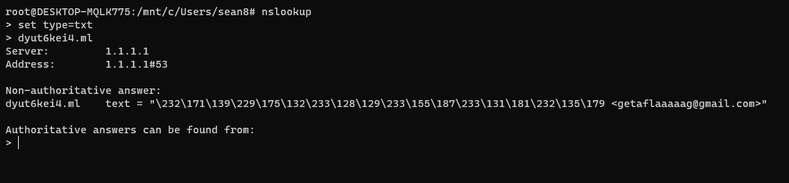
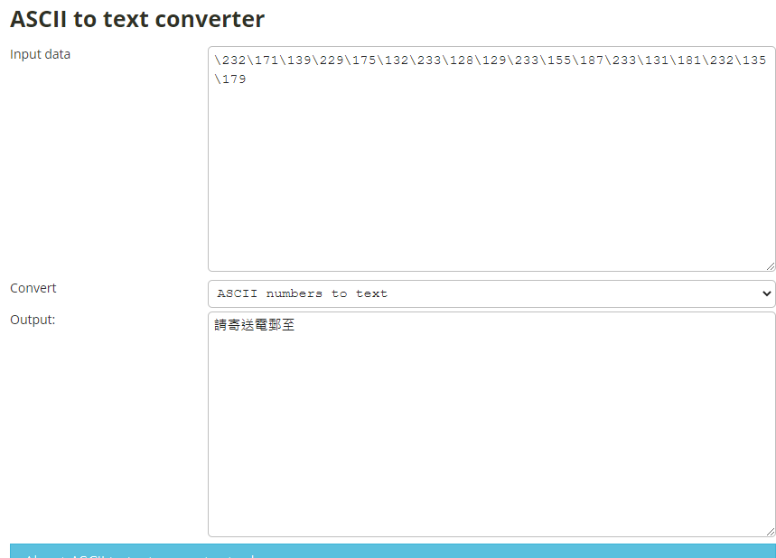
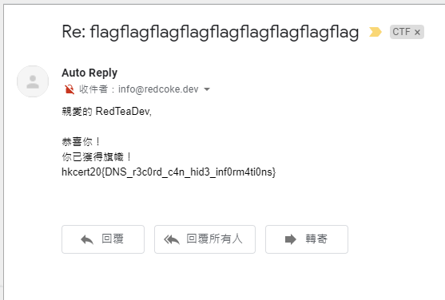

# Web Exploitation 網站保安 / DNS

## Challenges - 50 Pts(Init: 500 Pts) - 20 Solved

__Solved by S0083 - [RedTeaDev](https://github.com/RedTeaDev)__

```
Author 作者：blackb6a

Description 描述：

Do you know what is Domain Name System ?_?

你知道什麼是域名系統嗎 ？_？

http://dyut6kei4.ml/
```
Hint:
```
https://docs.aws.amazon.com/zh_tw/vpc/latest/userguide/verify-domains.html
```

This Challenge is petty easy, i am surprised why only **20/74** team solved

## Solve: 
first at all, when I saw the Description, i immediately know this challenges Flag is hidden on TXT record, so I open a command prompt and used **Nslookup**



[*\] *Actually if i used some online tools, i can skip this part, but anyway :|*

The `\232\171\139\229\175\132\233\128\129\233\155\187\233\131\181\232\135\179` is ASCII numbers, let's convert
it to text!



so it asking us to send Email to **getaflaaaaag@gmail.com**!
after sending the email for like a little while, we got the email!!!


## Flags:

`hkcert20{DNS_r3c0rd_c4n_hid3_inf0rm4ti0ns}`
