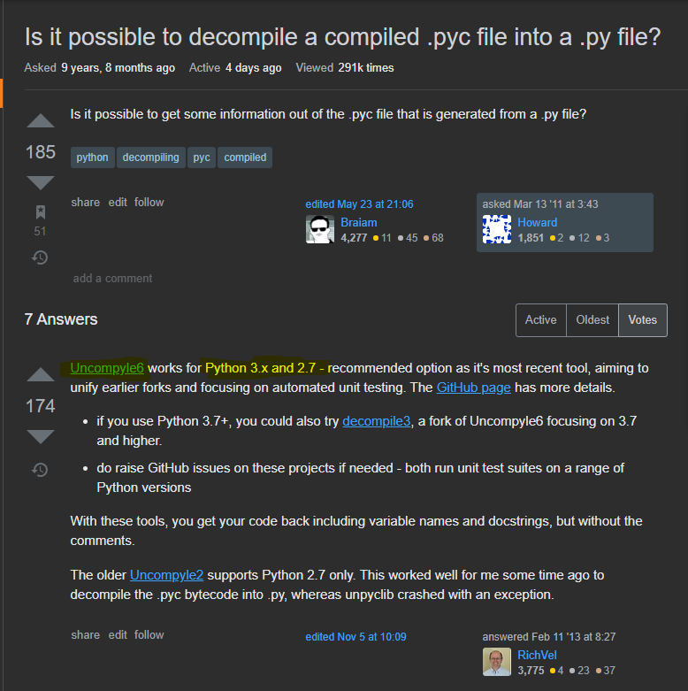
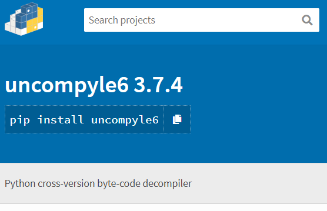

# Reverse Engineering 逆向工程 / Python Secret

## Challenges - 50 Pts(Init: 500 Pts) - 43 Solved - (Try this first)

__Solved by S0083 - [RedTeaDev](https://github.com/RedTeaDev)__

```


Author 作者：VXRL

Description 描述：

After you watch news about virus outbreak in China Secret Club on a news portal, suddenly, you have found an interesting python_secret.pyc file on your computer desktop. Please help find the secret value.

在新聞網站上看到有關中國秘密俱樂部病毒爆發的新聞後，突然之間，您在計算機桌面上發現了一個有趣的 python_secret.pyc 文件。請幫助尋找秘密價值。

```
Hint:
```
Disassembly will be helpful

反編譯會有用
```


## Solve: 
first at all, i saw that it was .pyc file, and i immediately know i need an pyc decompiler and then i went to search 
for 'pyc decompiler' and this result get me:

 


after I installed uncompyle6 with via `pip install uncompyle6` and then search for his usage, then i do

`uncompyle6 ./python_secret.pyc` and it returns

```python
# uncompyle6 version 3.7.4
# Python bytecode 3.8 (3413)
# Decompiled from: Python 3.8.0 (tags/v3.8.0:fa919fd, Oct 14 2019, 19:37:50) [MSC v.1916 64 bit (AMD64)]
# Embedded file name: python_secret.py
# Compiled at: 2020-11-01 23:15:22
# Size of source mod 2**32: 413 bytes
s3cr3t = input('A super secret:')

def gen_s3cr3t(sup3r_secret):
    balltse = 99999
    gigi = 8888
    chloe = 777
    baileys = 66
    super_s3cr3t = balltse & gigi
    super_s3cr3t = (super_s3cr3t | chloe) << 2
    super_s3cr3t = super_s3cr3t ^ baileys ^ 54
    return str(sup3r_secret) == str(super_s3cr3t)


if gen_s3cr3t(s3cr3t):
    print('Congrats! The flag is hkcert20{%s}' % s3cr3t)
else:
    print('Try harder :-)')
# okay decompiling ./python_secret.pyc
```

and then I know the flag are hidden inside the gen_s3cr3t, you can see that the flag does not contain any Strings
only with an integer, so I make a small edit to brute-Force the script attempt to get the Flags
Here is my Code:

```python
import sys
unkown = 100000 # burte-force check loop range


def gen_s3cr3t(sup3r_secret):
    balltse = 99999
    gigi = 8888
    chloe = 777
    baileys = 66
    super_s3cr3t = balltse & gigi
    super_s3cr3t = (super_s3cr3t | chloe) << 2
    super_s3cr3t = super_s3cr3t ^ baileys ^ 54
    return str(sup3r_secret) == str(super_s3cr3t)

for attempt in range(unkown):
    s3cr3t = attempt
 
    if gen_s3cr3t(s3cr3t):
        sys.stdout.flush()
        sys.stdout.write("\r")
        sys.stdout.write("Pwned! |Flags Found! >>>>>>>>>>>>>")
        sys.stdout.write('Congrats! The flag is hkcert20{%s}' % s3cr3t)
        exit(0)
    else:
        sys.stdout.write("\r")
        sys.stdout.write("Attmpting to burte-force... Now: " + str(attempt))
        sys.stdout.flush()
```

[*\]After this CTF, admin told me that there are actually a better method:

```python
def gen_s3cr3t():
    balltse = 99999
    gigi = 8888
    chloe = 777
    baileys = 66
    super_s3cr3t = balltse & gigi
    super_s3cr3t = (super_s3cr3t | chloe) << 2
    super_s3cr3t = super_s3cr3t ^ baileys ^ 54
    print(super_s3cr3t)

gen_s3cr3t()
```
by running this script, you will get something like this after running for few seconds:
```
➜ py .\python_secret_solve.py
 Found! >>>>>>>>>>>>>Congrats! The flag is hkcert20{3600}
 ```
Flag!

## Flags:

`hkcert20{3600}`
