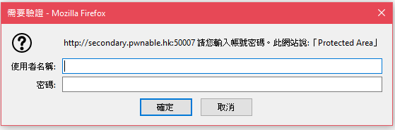
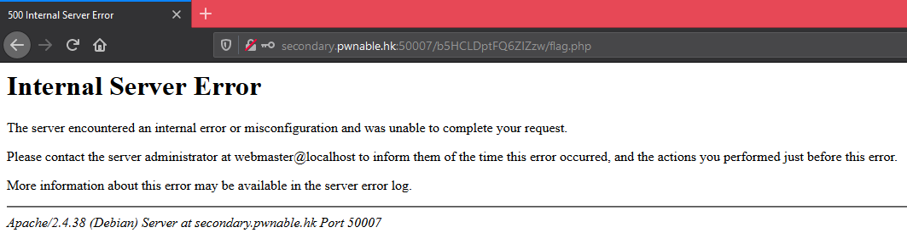
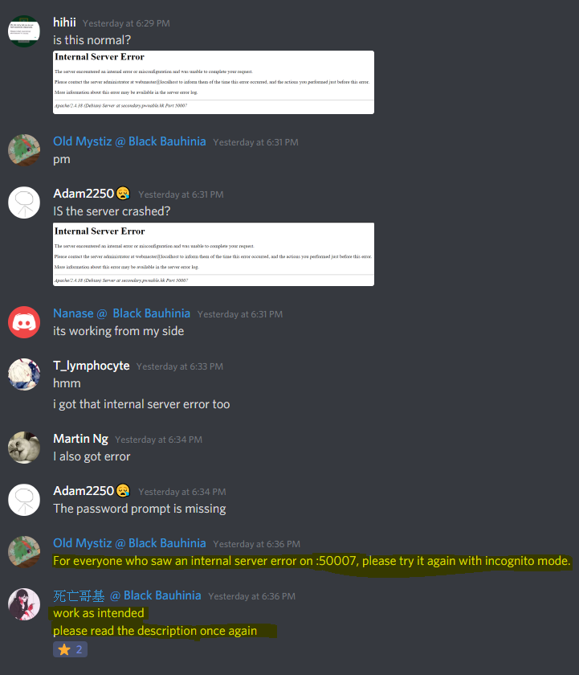

# Web Exploitation 網站保安 / Rickroll 

## Challenges - 498 Pts(Init: 500 Pts) - 2 Solved

__Solved by S0083 - [RedTeaDev](https://github.com/RedTeaDev) __
```
Author 作者：blackb6a

Description 描述：

Victoria, a friend of Dr Ke, is trying to build a new website. 
She is not familiar with it and didn't set any password protection yet. Can you find Victoria's secret?

維多利亞是奇異博士的朋友。她正在建設一個新的網站但未有設立密碼。你能找到維多利亞的秘密嗎？

In case of any discrepancy between the English version and the Chinese version, the English version shall prevail.

中文譯本僅供參考，文義如與英文有歧異，概以英文本為準。

http://secondary.pwnable.hk:50007
```
Hint:
```
Did you pay attention in Dr Ke class on 31st October?

提示： 你在十月三十一日有專心上奇異博士的課堂嗎？
```

## Solve: 
so we can see that http://secondary.pwnable.hk:50007/ redirect you to [Rick Astley - Never Gonna Give You Up (Video)](https://youtu.be/dQw4w9WgXcQ)

then we goto [/robots.txt](http://secondary.pwnable.hk:50007/robots.txt), we could see that it Disallow the [/b5HCLDptFQ6ZIZzw/flag.php](http://secondary.pwnable.hk:50007/b5HCLDptFQ6ZIZzw/flag.php). That the Flags!
```
User-agent: *
Disallow: /b5HCLDptFQ6ZIZzw/
Disallow: /b5HCLDptFQ6ZIZzw/flag.php
```
so we go [[/5HCLDptFQ6ZIZzw/flag.php]](http://secondary.pwnable.hk:50007/b5HCLDptFQ6ZIZzw/flag.php) and we can see this:


but since we have no idea the password and username, so i tired many common password like 
`admin, root, pass, user, victoria` or something like that, but it return 500 Internal Server Error



at the first time, i though the server overloaded or something, but i saw this message



so i decided to connect by using [cURL](https://en.wikipedia.org/wiki/CURL) with different http request Method

i tired `POST, GET, PUT, PATCH, DELETE`, then it got me thinking, what if i tired to use some Method that not commonly used?

and then i typed:

`curl -X COPY http://secondary.pwnable.hk:50007/b5HCLDptFQ6ZIZzw/flag.php`

and then.. i got the Flag!

```
Congraulations! You get the flag.<br>hkcert{misc0nfiguration_0f_htacc3ss_is_fata1}
<script>
	setTimeout(function () {
   window.location.href= 'https://www.youtube.com/watch?v=gkTb9GP9lVI&ab_channel=JwHDify';
}, 5000);
</script>
```

## Flags:

`hkcert{misc0nfiguration_0f_htacc3ss_is_fata1}`
